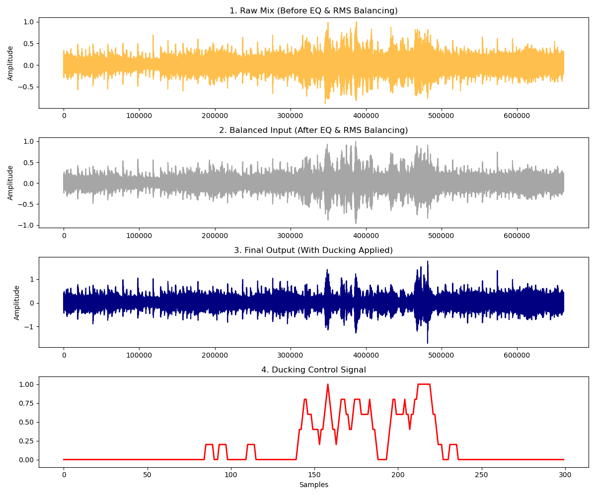

# SpectralDucker: Automated Speech-Music Mixing using PSD Analysis
A Python-based Digital Signal Processing (DSP) system that dynamically adjusts background music volume in the presence of human speech. Unlike traditional compressors, this system uses Power Spectral Density (PSD) analysis to intelligently detect speech and apply smooth "ducking" transitions.

## Features
- **PSD-Based Detection**: Uses Welch’s method to identify speech within the 300Hz–3000Hz frequency band.
- **3-Band Equalization**: Automatically carves out spectral space by cutting music mids (-3dB) and boosting speech mids (+2db) to prevent frequency masking.
- **RMS Loudness Matching**: Balances the perceived energy of music and speech layers before mixing for professional-grade consistency.
- **Smoothing Filter**: Implements a boxcar moving average to ensure natural volume transitions and prevent "clicking" artifacts.

---

## Performance & Results
The system was trained on the GTZAN Music/Speech collection. By analyzing the frequency content, a decision boundary was established to distinguish between layers.

#### PSD Feature Extraction

| Metric | Log-Magnitude Value |
| :--- | :--- |
| Average Speech PSD ($μs$​) | -5.6106 | 
| Average Music PSD ($μm$​) | -5.3369 |
| Calculated Threshold ($θ$) | -5.4738 |

#### System Output Comparison
The following plots visualize the transformation from the raw, overlapping mix to the final, balanced, and ducked output.

#### Figure 1: (1) Raw Mix, (2) Balanced Input after EQ, (3) Final Ducked Output, (4) Smoothed Control Signal.

---

## Methodology
The system follows a 5-stage architecture:
1.  **Preprocessing**: Normalization of signals to $[−1.0,1.0]$.
2.  **Spectral Equalization**: Butterworth SOS filtering to separate frequency bands.
3.  **Feature Extraction**: Logarithmic PSD computation using Welch's method.
4.  **Decision Smoothing**: Applying a moving average to the raw binary detection.
5.  **Signal Mixing**: Weighted sum mixing using a ducking factor of $α = 0.94$.

---

## Project Structure
- `speech-music-seperation-equalizer.ipynb`: Core logic for signal processing and visualization.
- `result/output_equalized.wav`: Final processed audio sample.

---

## Resources
-  **Dataset:** [GTZAN Music/Speech Collection (Kaggle)](https://www.kaggle.com/datasets/lnicalo/gtzan-musicspeech-collection)
-  **Dependencies:** `NumPy`, `SciPy`, `Matplotlib`

